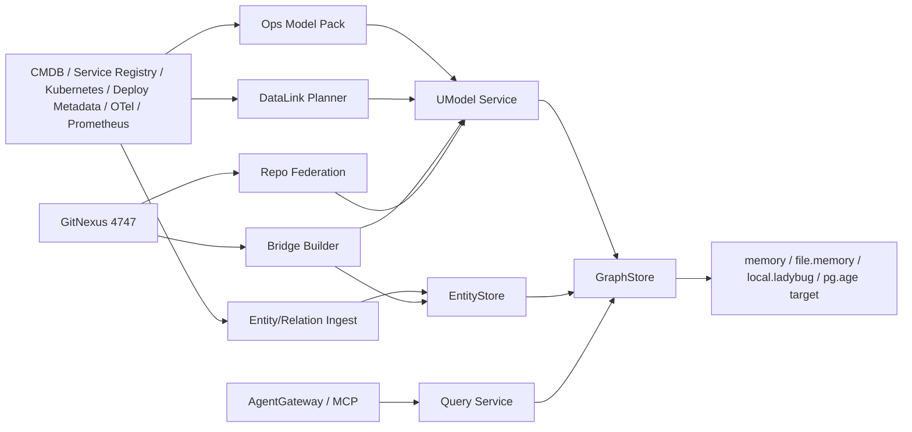

# Operations World Model Foundation

中文：[运维世界模型技术底座架构](../../zh/architecture/operations-world-model-foundation.md)

## Decision Summary

The architecture shifts from a database knowledge graph to an operations world model. UModel owns domain modeling, monitoring modeling, and overall model access management. GitNexus owns code graph construction, function-level call graphs, and code impact analysis. PostgreSQL + Apache AGE is the target unified persistence layer, but until UM-08 is complete, P0/P1 must not change the `GraphStore` contract and should keep validating with existing providers.

New architecture layers:

| Layer | Responsibility | Issue |
|---|---|---|
| DataLink | Bind entities to metrics/logs/traces/events and return query plans | UM-09 |
| Bridge builder | Build service-to-repo/module/API bridge edges | UM-10 |
| Cross-repo federation | Isolate each repo in a `code.<repo>` domain | UM-11 |

The database graph remains as a `db` subdomain.

## Existing Context

`internal/bootstrap/app.go:NewAppWithGraphStore` wires GraphStore into UModel, EntityStore, Query Service, Search Service, and AgentGateway (`internal/bootstrap/app.go` L63-L104).

REST routes already cover `/api/v1/umodel/`, `/api/v1/entitystore/`, `/api/v1/query/`, and `/api/v1/agent/` (`internal/bootstrap/app.go` L127-L140). Model writes are under UModel routes, runtime writes under EntityStore routes, and reads under Query routes.

Server and MCP select GraphStore with `--graphstore` and use memory for quickstart when the provider is not explicit (`cmd/umodel-server/main.go` L14-L40, `cmd/umodel-mcp/main.go` L24-L65).

Query Service is plan-only (`internal/query/service.go` L10-L13, L34-L57). Prometheus planning already emits `prometheus_promql` plans from metric definitions and DataLink mappings (`internal/query/executor.go` L769-L823).

## GitNexus Impact Assessment

Evidence:

- Baseline: `e5005a51145a88bd0c83cbb4e425554c046032c3`.
- Fresh graph: `UnifiedModel-qfa72-qfa73-main`.
- Graph size: 11,445 nodes / 21,474 edges / 235 clusters / 300 flows.
- Local 4747 service reported a PostgreSQL+AGE backend and had `UnifiedModel-ruiaylin` indexed at the same commit.

Impact:

| Target | Result | Risk handling |
|---|---|---|
| `GraphStore` interface | MEDIUM, 38 impacted nodes | Do not change the contract |
| `NewProvider` | HIGH, 7 impacted nodes; affects server and MCP startup | Leave provider work to UM-08 |
| `NewAppWithGraphStore` | HIGH, 6 impacted nodes | Do not change bootstrap |
| `Service.Execute` | Query tests cover callers | Avoid SPL changes in this phase |
| `WriteEntities` | Sample import and expire flows are upstream | Use existing EntityStore writes |

Dependency path:

```text
cmd/umodel-server main
  -> bootstrap.NewAppWithGraphStore
  -> graphstore.NewProvider
  -> GraphStore provider
  -> UModel / EntityStore / Query / AgentGateway
```

This design is low risk because it is documentation, model-pack, and fixture oriented. Future provider, DataLink API, or GitNexus adapter work must be reviewed separately.

## Target Architecture



## Data Flow

L1 topology:

```text
CMDB / Service Registry / Kubernetes / Deploy Metadata
  -> deterministic normalization
  -> EntityStore entities:write / relations:write
  -> .entity / .topo / AgentGateway
```

L2 monitoring:

```text
Prometheus / Log / Trace / Event metadata
  -> metric_set/log_set/trace_set/event_set
  -> data_link + storage_link
  -> .entity_set get_metrics/get_logs
  -> query plan
```

L3 code:

```text
GitNexus repo analysis
  -> repo/module/key API coarse export
  -> code.repo + code.<repo>.module + code.<repo>.api
  -> implements/exposes bridge relation
```

## Interface Contract

No new public read API in P0/P1. Existing contracts stay primary:

| Purpose | REST |
|---|---|
| Model import | `POST /api/v1/umodel/{workspace}/import` |
| Entity write | `POST /api/v1/entitystore/{workspace}/entities:write` |
| Relation write | `POST /api/v1/entitystore/{workspace}/relations:write` |
| Query | `POST /api/v1/query/{workspace}/execute`, `explain` |
| Agent | `GET /api/v1/agent/{workspace}/discover`, `POST /api/v1/agent/{workspace}/tools:execute` |

GitNexus integration is an internal adapter contract for UM-10. It should export only coarse repo/module/API anchors and bridge edges. Function and method call edges remain in GitNexus.

## Data / Migration Plan

No public schema or contract migration. PG+AGE remains a target provider until UM-08 passes review. Existing providers remain defaults. Database graph work moves to the optional `db` subdomain. Rollback is switching the GraphStore provider or workspace, not dropping AGE data.

## Implementation Slices

1. UM-01 operations model pack.
2. UM-02 architecture and sample layout.
3. UM-03 MVP chain: service to host/workload to telemetry plan to code repo.
4. UM-09 DataLink coverage and Prometheus plan validation.
5. UM-10 bridge builder with static mapping first, GitNexus export second.
6. UM-11 repo federation and domain conflict detection.
7. UM-05 query evaluation and coverage checks.
8. UM-06 operations modeling governance.

## Test Strategy

| Layer | Validation |
|---|---|
| Docs | `git diff --check`, link and AC mapping review |
| Model pack | `umctl umodel validate`, `umctl umodel import` |
| EntityStore | `umctl entity write`, `umctl topo write`, expire/idempotency tests |
| Query | `.umodel`, `.entity`, `.topo`, `.entity_set get_metrics/get_logs` golden cases |
| Agent/MCP | `umodel-mcp --quickstart --manifest`, `query_spl_execute` |
| Provider | memory/file.memory now; pg+age contract tests after UM-08 |

## Risks

| Risk | Level | Mitigation |
|---|---|---|
| PG+AGE provider incomplete | High | Keep P0/P1 provider-neutral |
| GitNexus external dependency | Medium | Store only coarse exports and stable anchors |
| Automatic source errors | High | Prefer deterministic sources and freshness windows |
| Telemetry privacy | Medium | Store DataLink/query plans, not raw data |
| Cross-repo naming conflicts | Medium | Use one `code.<repo_slug>` domain per repo |
| SPL compatibility | Medium | Avoid parser/executor changes in this phase |
| GraphStore contract expansion | High | Keep UM-08 as separate provider design |

## Acceptance Mapping

UM-02 AC-01 through AC-06 are covered by the module diagram, multi-source data flow, storage strategy, API/CLI boundaries, test strategy, and phased roadmap above.
