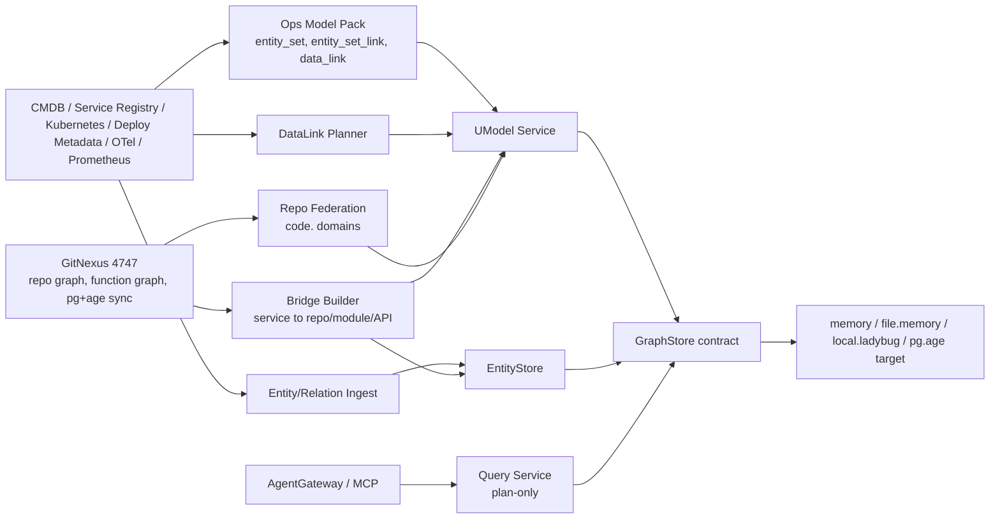

# 运维世界模型技术底座架构

English: [Operations World Model Foundation](../../en/architecture/operations-world-model-foundation.md)

## Decision Summary

推荐把技术底座从“数据库知识图谱”调整为“运维世界模型”。UModel 负责领域建模、监控建模、总体模型访问管理；GitNexus 负责代码图谱构建、函数级调用图与代码影响面；PostgreSQL + Apache AGE 是统一持久化目标，但 UM-08 尚未完成前，P0/P1 不改 `GraphStore` contract，仍使用现有 `memory`、`file.memory`、`local.ladybug` 能力验证模型与查询面。

主线新增三个架构层：

| 层 | 责任 | 对应 issue |
|---|---|---|
| DataLink 层 | 连接 EntitySet/Link 与 Metric/Log/Trace/Event/Profile，只生成查询计划 | UM-09 |
| 桥边构建层 | 构建 service 到 repo/module/API 的粗粒度映射 | UM-10 |
| 跨 repo 联邦层 | 每 repo 独立 code domain，支持跨域桥边与查询 | UM-11 |

数据库图谱保留为 `db` 子域，不作为运维主线关键路径。

## Existing Context

当前启动和服务组装点集中在 `internal/bootstrap/app.go`：`NewAppWithGraphStore` 创建 GraphStore provider 后注入 UModel、EntityStore、Query Service、Search Service、AgentGateway，见 `internal/bootstrap/app.go` L63-L104。

REST 路由已覆盖本设计需要的写入和读取面：`/api/v1/umodel/`、`/api/v1/entitystore/`、`/api/v1/query/`、`/api/v1/agent/`，见 `internal/bootstrap/app.go` L127-L140；UModel model element 写入见 L411-L470；EntityStore entity/relation 写入见 L473-L530；Query execute/explain 见 L355-L409。

Server 和 MCP 都通过 `--graphstore` flag 选择 provider，并在 quickstart 未显式指定 provider 时使用 `memory`，见 `cmd/umodel-server/main.go` L14-L40、`cmd/umodel-mcp/main.go` L24-L65。

Query Service 是 plan-only：`ModePlan` 是唯一模式，`normalizeMode` 明确不执行真实存储查询，见 `internal/query/service.go` L10-L13、L34-L57。`.entity_set` 的 `get_metrics`/`get_logs` 已按 DataLink/StorageLink 生成下游查询计划，见 `docs/zh/guides/query-service.md` L67-L79。Prometheus 计划生成已存在，`prometheusMetricQuery` 输出 `dialect=prometheus_promql`、endpoint、query_type、step、label_matchers 等，见 `internal/query/executor.go` L769-L823。

现有样例已经包含多域 quickstart 与 incident-investigation，可作为运维世界模型的合成数据来源。

## GitNexus Impact Assessment

图谱依据：

- 本地 main 基线：`e5005a51145a88bd0c83cbb4e425554c046032c3`。
- fresh graph：`UnifiedModel-qfa72-qfa73-main`，11,445 nodes / 21,474 edges / 235 clusters / 300 flows。
- GitNexus 服务：`http://127.0.0.1:4747/api/info` 返回 `postgresql+age` backend；`/mcp/health` 正常；`UnifiedModel-ruiaylin` 已在服务侧索引到同一 main commit。

影响面：

| 模块/符号 | 图谱结果 | 风险 |
|---|---|---|
| `pkg/contract/contracts.go:GraphStore` | MEDIUM，38 impacted nodes；直接触达 `internal/graphstore/provider.go`、`internal/bootstrap/app.go`、Ladybug provider、docs；间接触达 server/MCP、CLI、SDK | 不改 contract |
| `internal/graphstore/provider.go:NewProvider` | HIGH，7 impacted nodes；影响 `cmd/umodel-server/main.go:main`、`cmd/umodel-mcp/main.go:run` | UM-08/PG+AGE 另行推进 |
| `internal/bootstrap/app.go:NewAppWithGraphStore` | HIGH，6 impacted nodes；server/MCP 启动流程是关键路径 | UM-02 不改 bootstrap |
| `internal/query/service.go:Service.Execute` | context 显示 query golden、search routing、EntityStore visibility 测试覆盖 | 若扩展 SPL 必须补测试 |
| `internal/entitystore/service.go:Service.WriteEntities` | context 显示 sample import、expire flows | 运行时写入沿现有接口走 |

依赖路径：

```text
cmd/umodel-server main
  -> bootstrap.NewAppWithGraphStore
  -> graphstore.NewProvider
  -> GraphStore provider
  -> UModel / EntityStore / Query / AgentGateway
```

```text
cmd/umodel-mcp run
  -> bootstrap.NewAppWithGraphStore
  -> AgentGateway
  -> Query Service
```

设计结论：UM-02 的架构返工以文档、model pack、样例和后续实现切片为主，不修改 provider registry、bootstrap、GraphStore、Query parser/executor 或公共 API。因此当前交付风险为 Low；后续 UM-08/UM-09/UM-10 若引入 provider、DataLink API 或 GitNexus adapter，分别按 High/Medium 风险单独评审。

重点验证路径：

- `make guard` 保持通过。
- `go test ./internal/query ./internal/entitystore ./internal/graphstore ./internal/bootstrap`。
- `go test ./tests/contract ./tests/e2e`。
- quickstart 使用 `memory` 不回归。
- `umodel-mcp --graphstore memory --quickstart --manifest` 可发现 AgentGateway 能力。

## Target Architecture



### Boundaries

| Component | Owns | Does not own |
|---|---|---|
| UModel | 领域模型、监控模型、workspace/domain、model element、总体访问管理 | 函数级代码图谱构建 |
| EntityStore | runtime entity/relation write、lifecycle、idempotency | 公共读取 API |
| Query Service | `.umodel`、`.entity`、`.topo`、`.entity_set` 查询和 plan envelope | 原始 Prometheus/Log/Trace 查询执行 |
| AgentGateway/MCP | Agent discovery、resources、tools，底层复用 Query Service | 绕过 Query Service 读取 GraphStore |
| GitNexus | repo/module/function graph、代码影响面、pg+age sync | 运维实体主数据治理 |
| GraphStore provider | 持久化与受控图访问 | 领域语义解释 |

## Data Flow

### L1 拓扑

```text
CMDB / Service Registry / Kubernetes / Deploy Metadata
  -> deterministic normalization
  -> EntityStore entities:write / relations:write
  -> GraphStore
  -> .entity / .topo / AgentGateway
```

L1 只接收确定性来源或人工确认来源。自动发现可进入图谱，但必须带 `confidence=inferred` 和较短 `keep_alive_seconds`。

### L2 监控

```text
Prometheus / Log / Trace / Event metadata
  -> metric_set/log_set/trace_set/event_set
  -> data_link + storage_link
  -> .entity_set get_metrics/get_logs
  -> query plan with PromQL/Elasticsearch payload
```

遥测原始数据不入 UModel GraphStore。UModel 只保存数据集定义、实体到数据集映射、存储配置引用和查询计划。

### L3 代码

```text
GitNexus repo analysis
  -> repo/module/key API coarse export
  -> code.repo + code.<repo>.module + code.<repo>.api
  -> implements/exposes bridge relation
  -> .topo from service to code coarse nodes
```

函数级调用图、文件级影响面、符号上下文留在 GitNexus。UModel 通过 `gitnexus_repo`、`git_ref`、`file_path`、`symbol` 等属性保存可追溯锚点。

## Interface Contract

P0/P1 不新增公共读取 API。现有接口继续作为主契约：

| 用途 | REST |
|---|---|
| workspace 管理 | `POST/GET/PUT/DELETE /api/v1/workspaces` |
| model pack 导入 | `POST /api/v1/umodel/{workspace}/import` |
| model element 写入 | `POST /api/v1/umodel/{workspace}/elements` |
| entity 写入/过期 | `POST /api/v1/entitystore/{workspace}/entities:write`、`entities:expire` |
| relation 写入/过期 | `POST /api/v1/entitystore/{workspace}/relations:write`、`relations:expire` |
| 查询/解释 | `POST /api/v1/query/{workspace}/execute`、`explain` |
| Agent | `GET /api/v1/agent/{workspace}/discover`、`POST /api/v1/agent/{workspace}/tools:execute` |

CLI contract：

| 用途 | CLI |
|---|---|
| 导入模型 | `umctl umodel import <workspace> <path>` |
| 写实体 | `umctl entity write <workspace> --file <path>` |
| 写拓扑 | `umctl topo write <workspace> --file <path>` |
| 查询 | `umctl query run <workspace> "<SPL>"` |
| Agent 发现 | `umctl agent discover <workspace>` |

GitNexus adapter contract 是后续 UM-10 的内部 contract，不直接暴露给最终用户：

```json
{
  "repo": "UnifiedModel-ruiaylin",
  "git_ref": "e5005a51145a88bd0c83cbb4e425554c046032c3",
  "domain": "code.unifiedmodel",
  "entities": ["code.repo", "code.unifiedmodel.module", "code.unifiedmodel.api"],
  "relations": ["implements", "exposes"],
  "export_scope": "coarse",
  "excludes": ["function_call_edges", "method_call_edges"]
}
```

如果 UM-09 后续新增 `data_links:write` 便利接口，它必须只是 `data_link` model element 写入的包装，不得绕过 UModel Service，也不得返回原始遥测数据。

## Data / Migration Plan

不迁移公共 schema，不修改 `pkg/model`，不修改 `pkg/contract`。新增数据资产为：

- 运维 model pack。
- 合成 EntityStore entity/relation fixture。
- DataLink/StorageLink/Prometheus 示例。
- GitNexus bridge 粗粒度同步 fixture。

PG+AGE 计划：

- UM-08 完成前，默认后端仍为 `memory` 或 `file.memory`，`local.ladybug` 可选。
- UM-08 完成后，`pg.age` 作为可选 provider 纳入配置，不改变 REST/CLI/MCP 读写 shape。
- 不自动迁移旧 workspace；需要时用导出/导入或后台 backfill issue 单独处理。
- 回滚方式是切回 `memory`、`file.memory` 或 `local.ladybug`，不自动删除 AGE graph。

数据库图谱旧线：

- 保留 `db` 子域 model pack。
- 不作为 UM-03/UM-09/UM-10/UM-11 的前置。
- 可在后续数据库子域 issue 中单独推进 DDL/元数据抽取。

## Implementation Slices

1. S：UM-01 model pack 落地，覆盖 `infra`、`apm`、`biz`、`ops`、`code` domain。
2. S：UM-02 架构文档与样例目录规划，明确 UModel/GitNexus/PG+AGE 边界。
3. M：UM-03 MVP，合成跑通 `apm.service -> infra.host/workload -> Prometheus query plan -> code.repo`。
4. M：UM-09 DataLink，补齐 Prometheus DataLink 完整性检查和 plan 验证。
5. M：UM-10 桥边构建，先做静态 `service -> repo` 映射，再接 GitNexus 粗粒度导出。
6. S：UM-11 跨 repo 联邦，落地 `code.<repo>` domain 规范和冲突检测。
7. M：UM-05 查询评估，加入孤岛 service/repo、DataLink 覆盖率、桥边覆盖率、跨域追溯测试。
8. M：UM-06 建模治理，加入来源可信度、时效性、命名、关系方向和 ownership 规则。

## Test Strategy

| 层 | 验证 |
|---|---|
| 文档/架构 | `git diff --check`，链接检查，AC mapping 审查 |
| Model pack | `umctl umodel validate`、`umctl umodel import` |
| EntityStore | `umctl entity write`、`umctl topo write`、idempotency 与 expire 测试 |
| Query | `.umodel`、`.entity`、`.topo`、`.entity_set get_metrics/get_logs` golden |
| Agent/MCP | `umodel-mcp --quickstart --manifest`、`query_spl_execute` |
| Provider | 现阶段 memory/file.memory；UM-08 后加入 pg+age contract tests |
| E2E | 合成 incident/ops-world workspace，验证服务到主机、监控、代码桥边三条链 |

## Risks

| 风险 | 等级 | 缓解 |
|---|---|---|
| PG+AGE provider 未完成 | High | P0/P1 不依赖 pg+age；只把它作为目标 provider |
| GitNexus 是外部系统 | Medium | 粗粒度导出 contract 固化；函数级细节不复制到 UModel |
| 数据源自动化误判 | High | 确定性来源优先，自动发现必须带 confidence 与过期窗口 |
| 遥测数据隐私 | Medium | 原始 telemetry 不入图，只保存查询计划和 DataLink |
| 多 repo 命名冲突 | Medium | 每 repo 独立 `code.<repo_slug>` domain |
| Query/SPL 扩展破坏兼容性 | Medium | P0/P1 不改 parser/executor；后续扩展需 query golden |
| GraphStore contract 扩张 | High | UM-02 禁止改 contract；UM-08 单独评审 provider contract |
| 运维主线和数据库子域混淆 | Medium | `db` 子域降级为非阻塞能力，主线 AC 只验 L1/L2/L3 运维链路 |

## Acceptance Mapping

- UM-02 AC-01：本文包含模块划分和目标架构图。
- UM-02 AC-02：数据流已从 DDL/DML 单源调整为 CMDB、服务注册表、Kubernetes、部署元数据、Prometheus、GitNexus 多源。
- UM-02 AC-03：存储方案保留现有 provider，PG+AGE 作为 UM-08 目标 provider，不在 P0/P1 替换默认后端。
- UM-02 AC-04：API/CLI 边界明确，读取统一走 Query Service，MCP 通过 AgentGateway。
- UM-02 AC-05：测试策略覆盖文档、model pack、EntityStore、Query、MCP、provider、E2E。
- UM-02 AC-06：演进路径调整为 P0 验证、P1 L1+L2、P2 L3、P3 联邦、P4 评估治理闭环。
